# agents-info

AI Coding Agents 元信息集合：81 个 agent（Codex、Claude Code、WorkBuddy、Cursor…）的 skills 目录、官网、图标、开源仓库。拉取本仓库直接使用。

## Agent 总览

|  |  |  |  |
| --- | --- | --- | --- |
|  [AdaL](https://adalagent.ai) | 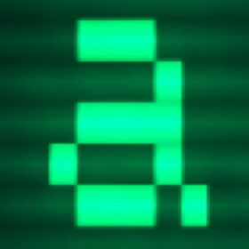 [AiderDesk](https://github.com/hotovo/aider-desk) |  [Amp](https://ampcode.com) |  [Antigravity](https://antigravity.google) |
|  [Antigravity CLI](https://antigravity.google) |  [AstrBot](https://astrbot.app) | 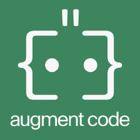 [Augment](https://www.augmentcode.com) |  [Autohand Code CLI](https://autohand.ai) |
|  [Claude Code](https://claude.com/product/claude-code) |  [Cline](https://cline.bot) |  [Code Studio](https://www.syncfusion.com/code-studio/) |  [CodeArts Agent](https://codearts.huaweicloud.com) |
|  [CodeBuddy](https://www.codebuddy.ai) | 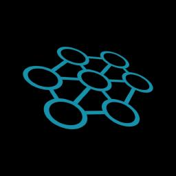 [Codemaker](https://codemaker.ai) |  [Codex](https://openai.com/codex) |  [Comate](https://comate.baidu.com) |
|  [Command Code](https://commandcode.ai) | 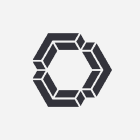 [Continue](https://continue.dev) | 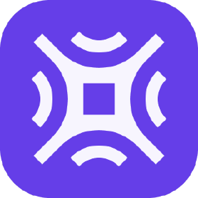 [Cortex Code](https://docs.snowflake.com/en/user-guide/cortex-code) |  [Crush](https://github.com/charmbracelet/crush) |
| 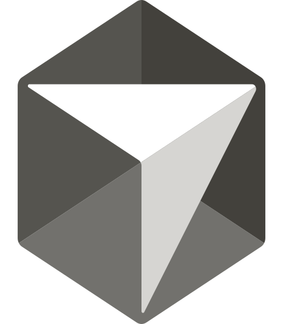 [Cursor](https://cursor.com) | 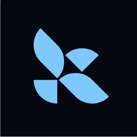 [Deep Agents](https://github.com/langchain-ai/deepagents) |  [Devin for Terminal](https://devin.ai) | 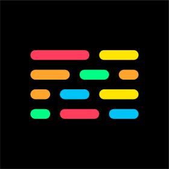 [Dexto](https://www.dexto.ai) |
|  [Droid](https://factory.ai) | 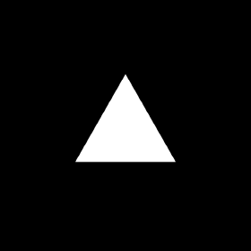 [Eve](https://vercel.com/eve) |  [Firebender](https://firebender.com) |  [ForgeCode](https://forgecode.dev) |
|  [Gemini CLI](https://github.com/google-gemini/gemini-cli) |  [GitHub Copilot](https://github.com/features/copilot) |  [Goose](https://block.github.io/goose) |  [Grok Build](https://github.com/xai-org/grok-build) |
|  [Hermes Agent](https://github.com/NousResearch/hermes-agent) | 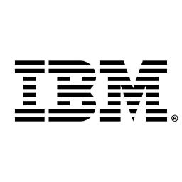 [IBM Bob](https://www.ibm.com/products/watsonx-code-assistant) |  [iFlow CLI](https://iflow.cn) |  [inference.sh](https://inference.sh) |
|  [JoyCode](https://joycode.jd.com) |  [Junie](https://www.jetbrains.com/junie/) |  [Kilo Code](https://kilocode.ai) |  [Kimchi](https://kimchi.dev) |
|  [Kimi Code CLI](https://code.kimi.com) |  [Kiro CLI](https://kiro.dev) | 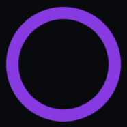 [Kode](https://github.com/shareAI-lab/Kode-cli) |  [Lingma](https://lingma.aliyun.com) |
|  [LM Studio](https://lmstudio.ai) |  [MCPJam](https://www.mcpjam.com) |  [MiniMax Code](https://agent.minimaxi.com) |  [Mistral Vibe](https://mistral.ai/products/vibe/) |
|  [Moxby](https://moxby.com) |  [Mux](https://usemux.ai) |  [Neovate](https://neovateai.dev) |  [Ona](https://ona.com) |
|  [OpenClaw](https://openclaw.ai) |  [OpenCode](https://opencode.ai) |  [OpenHands](https://github.com/All-Hands-AI/OpenHands) |  [Pi](https://pi.dev) |
|  [Pochi](https://app.getpochi.com) |  [Posit Assistant](https://posit.co) |  [Qoder](https://qoder.com) |  [Qoder CN](https://www.aliyun.com/product/qoder) |
|  [Qwen Code](https://github.com/QwenLM/qwen-code) |  [QwenWork](https://qwenwork.ai) |  [QwenWork CN](https://qwenwork.cn) |  [Reasonix](https://reasonix.io) |
|  [Replit](https://replit.com) |  [Roo Code](https://roocode.com) | 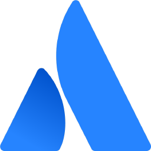 [Rovo Dev](https://www.atlassian.com/rovo) | 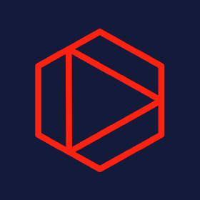 [Tabnine CLI](https://tabnine.com) |
|  [Terramind](https://terramind.com) |  [Tinycloud](https://www.tinycloud.sh) |  [Trae](https://trae.ai) |  [Trae CN](https://trae.com.cn) |
| Universal |  [Warp](https://www.warp.dev) |  [Windsurf](https://windsurf.com) |  [WorkBuddy](https://workbuddy.cn) |
|  [WorkBuddy AI](https://www.workbuddy.ai) |  [ZCode](https://zcode.z.ai) | 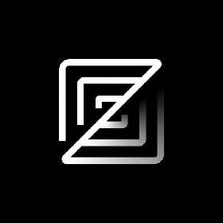 [Zed](https://zed.dev) |  [Zencoder](https://zencoder.ai) |
|  [Zenflow](https://zencoder.ai/zenflow) |  |  |  |

## 目录结构

```
agents-info/
├── agents.jsonl   # 数据：每行一个 agent
├── icons/         # 图标 72 个：路径见各条目的 icon 字段
├── scripts/       # gen-readme.mjs：重新生成本 README
└── docs/          # SCHEMA.md 数据结构详解 · DESIGN.md 设计说明 · AUDIT.md 数据核查记录
```

## agents.jsonl 数据结构

每行一个 JSON 对象：

```jsonl
{"name":"codex","display":"Codex","website":"https://openai.com/codex","icon":"icons/codex-color.svg","repo":"https://github.com/openai/codex","stars":126881,"skills_dir":{"env_home":{"var":"CODEX_HOME","default":".codex","path":"skills"}},"detect":[{"env_home":{"var":"CODEX_HOME","default":".codex"}},{"system":"/etc/codex"}]}
```

| 字段 | 类型 | 说明 |
| --- | --- | --- |
| `name` | string | 唯一标识符 |
| `display` | string | 展示名 |
| `website` | string \| null | 官网 |
| `icon` | string \| null | 图标路径（仓库相对路径或 https URL） |
| `repo` | string \| null | 开源仓库地址（仅产品源码开源时填写；共 31 个） |
| `stars` | number \| null | 仓库 star 数快照（千位为约数） |
| `skills_dir` | object | 全局 skills 目录定位规则（home / config / env_home / env_var 四种写法） |
| `detect` | array | 安装检测条件，满足任一即视为已安装 |

字段语义、`skills_dir` 定位与 `detect` 检测键的完整说明见 [docs/SCHEMA.md](docs/SCHEMA.md)。

## License

MIT
